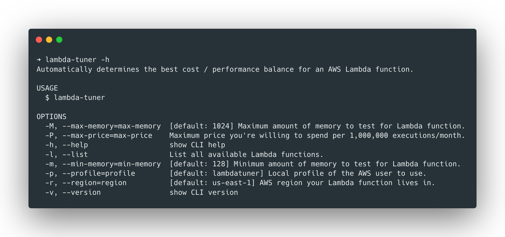

lambda-performance-tuner
========================

**[ ! ] This project is still very much WIP! Tuning functionality not yet available.**

Automatically determines the best cost / performance balance for an AWS Lambda function.

[](https://oclif.io)
[](https://npmjs.org/package/lambda-performance-tuner)
[](https://npmjs.org/package/lambda-performance-tuner)
[](https://github.com/philippjbauer/lambda-performance-tuner/blob/master/package.json)

# Table of Contents
<!-- toc -->

- **[Why this tool?](#why-this-tool)**
- **[Installation and Setup](#installation-and-setup)**
- **[Usage](#usage)**

# Why this tool?
<!-- … but why? -->

As per Amazon's **Serverless Architectures with AWS Lambda** whitepaper*, there's a point of diminishing returns when dialing up the memory size of a Lambda function. At a certain point, the time it takes to execute the function does not get faster but the price to run the function goes up. This tool is aimed to automatically determine the optimal Lambda function memory size to run as fast as possible without spending more than necessary for the function execution.

*[Download Whitepaper](https://d1.awsstatic.com/whitepapers/serverless-architectures-with-aws-lambda.pdf), see page 27 and following.


# Installation and Setup
<!-- setup -->

Download or clone the repository into a folder of your choice.

```bash
git clone https://github.com/philippjbauer/lambda-performance-tuner.git
```

## Create AWS Account & Policy

Log in to your AWS account and create a new policy with the following configuration, call it **LambdaPerformanceTunerAccess**.

```json
{
    "Version": "2012-10-17",
    "Statement": [
        {
            "Sid": "LambdaPerformanceTuner",
            "Effect": "Allow",
            "Action": [
                "lambda:ListFunctions",
                "lambda:InvokeFunction",
                "lambda:UpdateFunctionConfiguration",
                "lambda:GetFunctionConfiguration"
            ],
            "Resource": "*"
        }
    ]
}
```

Create a user with **Programmatic access** called **LambdaPerformanceTuner** and attach the policy to the user. Take note of both the **access key ID** and **secret access key**, you'll need them in the next step.

## Modify local AWS config

Add a new profile **lambdatuner** (or name of your choosing) to your `~/.aws/credentials` file like in the example below. You can use the `-p "my-profile"` option to switch between profiles.

```ini
# ~/.aws/credentials
[lambdatuner]
aws_access_key_id=AKIA***********LSGNX
aws_secret_access_key=fJSuPKDx************************UxSwILfW
```

Add a new profile **lambdatuner** (or name of your choosing) to your `~/.aws/config` file like in the example below.

```ini
# ~/.aws/config
[lambdatuner]
region=us-east-1
output=json
```

## Global Installation / Use `lambda-tuner`

You can run `npm link` in this directory to install the CLI globally and get access to the CLI command `lamda-tuner`!

# Usage
<!-- usage -->

To run execute `./bin/run` or `lambda-tuner` in your command line. 

## Help

To access the help screen, execute `./bin/run -h` or `lambda-tuner -h`.


